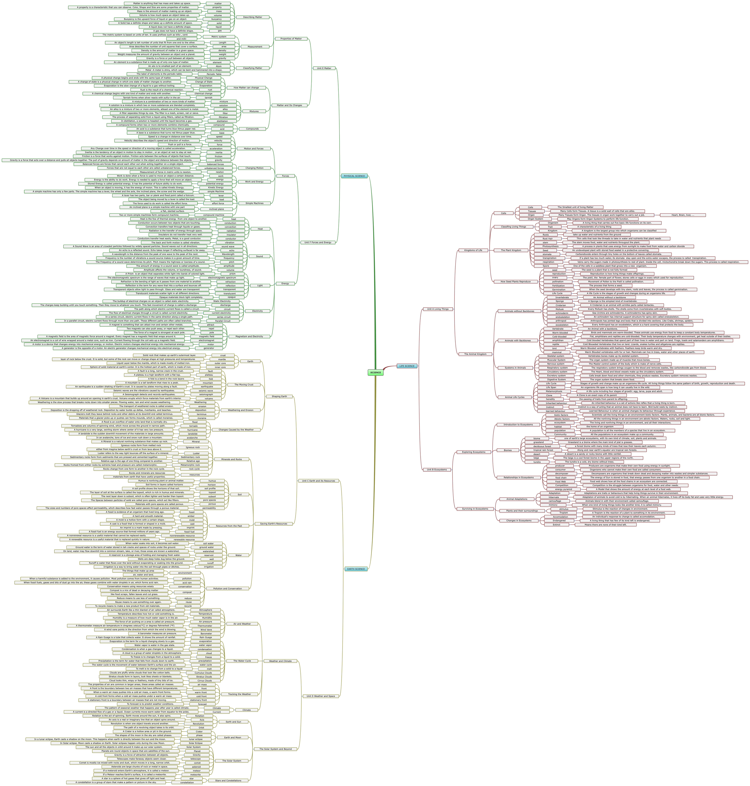

.. picothing documentation master file, created by
   sphinx-quickstart on Sun Aug 30 21:07:53 2015.
   You can adapt this file completely to your liking, but it should at least
   contain the root `toctree` directive.

Aashu's 4th Grade 
=================

Contents:

.. toctree::
   :maxdepth: 2

========
 MATHS
========
.. include:: _xtxt/Maths.xtxt
.. image:: _images/MATHS.jpg

========
 LOGIC
========
.. include:: _xtxt/Logic.xtxt
.. image:: _images/LOGIC.jpg

===================
 THINKING IN MATHS 
===================
.. include:: _xtxt/MathProblemSolving.xtxt
.. image:: _images/LOGIC.jpg

===================
 CRITICAL THINKING
===================
.. include:: _xtxt/CriticalThinking.xtxt

=========
 SCIENCE
=========
.. include:: _xtxt/science.xtxt

=====================
 SCIENCITIFIC METHOD
=====================
.. include:: _xtxt/ScienceGoals.xtxt

=========
 ENGLISH
=========
.. include:: _xtxt/english.xtxt
.. image:: _images/ELEMENTS_OF_LANGUAGE.jpg

============
 VOCABULARY
============
.. include:: _xtxt/Vocabulary.xtxt

============
 GEOGRAPHY
============
.. include:: _xtxt/Geography.xtxt

==========
 HISTORY
==========
.. include:: _xtxt/History.xtxt
.. image:: _images/AMERICAN_HISTORY.jpg

===========
 ANTHOLOGY
===========
.. include:: _xtxt/anthology.xtxt
.. image:: _images/ANTHOLOGY.jpg

========
 BOOKS
========
.. include:: _xtxt/books.xtxt

